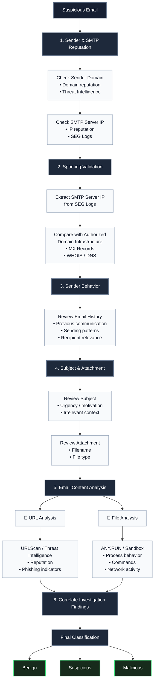
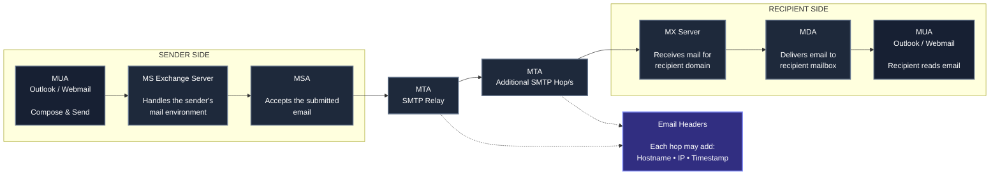
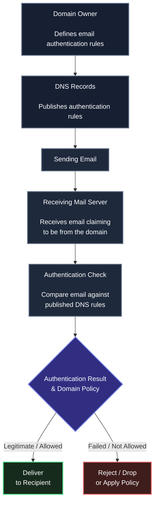
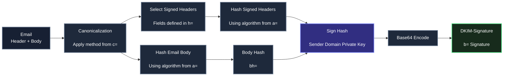
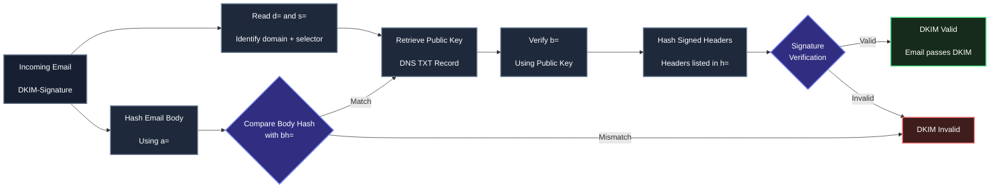
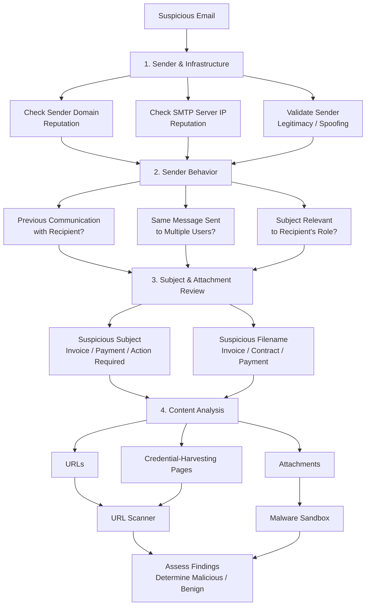

# Why Email Investigation is Important for SOC Analysts

Understanding the various techniques attackers use to gain initial access is crucial for security professionals to identify and prevent attacks before they can cause damage.

As per the IBM Security X-Force report, 41% of the attackers prefer phishing techniques to gain initial access to the victim’s environment, either by sending a weaponized document or a malicious link to the target victims.

### Phishing Attacks

A phishing email is a type of social engineering attack where an attacker tricks target victims into opening a malicious file or link or providing personal or confidential information, such as passwords and credit card numbers, through fraudulent emails. The reason why phishing is a preferred and

successful way for attackers to gain initial access to the victim’s environment is due to several factors, including the following:

- It is easy during the reconnaissance phase to acquire a list of target victim users’ email addresses.
- It is not hard to prepare a weaponized attachment or link.
- Many users lack security awareness.

### Email Threats Types

There are four common types of email threats that organizations face:

- **Spearphishing attachments**
- **Spearphishing links**
- **Blackmail emails**
- **Business Email Compromise**

> **NOTE!**
> Phishing and spearphishing are both types of email attacks that aim to steal sensitive information or compromise a target’s computer system. While both methods have the same ultimate goal, the **primary difference** between the two **is the level of targeting involved**.
>
> - **Phishing** emails are mass email attacks that are sent to a randomly large number of people.
> - **spearphishing** emails are much more targeted and personalized. They are specifically crafted to target a particular individual or group of individuals, such as employees of a particular company or members of a specific organization.

##### Spearphishing attachments

Here is the most common examples of phishing attachment types:

- **Malicious Microsoft Office documents**
  Attackers often use weaponized Word, Excel, or PowerPoint files, sometimes containing VBA macros, to trick victims into opening them and gain initial access. They are widely used because Microsoft Office is common in organizations, and these documents are relatively easy to weaponize.
  
- **Malicious PDF files**
  Attackers may use malicious PDFs to exploit PDF reader vulnerabilities or harvest credentials. PDFs can contain JavaScript, links, images, and fonts, which can make the file look legitimate and encourage the victim to interact with it.
  
- **Compressed files**
  Attackers may send `.rar`, `.7z`, or `.zip` files containing executable malware.
  The victim is then tricked into extracting and running the malicious file.

- **ISO images**
  Attackers increasingly use `.iso` files to deliver malware. Since ISO files behave like disk images, they can sometimes help bypass file filters and evade antivirus detection.
  
  When a user opens an ISO image, Windows can mount it as a virtual drive, allowing the user to access the files inside it. Older or less capable Secure Email Gateways may not deeply inspect the contents of ISO files, which can allow an ISO containing malicious files to pass through email security controls.
  
  Another important point is that files extracted or accessed from some mounted disk-image contexts may not receive the **Mark of the Web (MoTW)** metadata that would normally be applied to files downloaded from the Internet. This can reduce some of Windows' security warnings and make it easier for the user to execute a malicious file.
  
- **HTML files**
  Attackers may send HTML attachments that imitate familiar login pages, such as Microsoft, DHL, or banking pages, to trick victims into entering and revealing their credentials.
  
  Attackers can send HTML files containing JavaScript that redirects the user to or interacts with an external domain. Email security controls may inspect the HTML and identify suspicious URLs or domains, but this does not always prevent the attachment from reaching the user.
  
  When the user opens the HTML file, the browser renders it locally and the embedded JavaScript can perform malicious actions, such as displaying a fake login page and attempting to collect credentials, while communicating with an external attacker-controlled domain.

> **NOTE!**
> Phishing and spearphishing are both types of email attacks that aim to steal sensitive information or compromise a target’s computer system. While both methods have the same ultimate goal, the primary difference between the two is the level of targeting involved. Phishing emails are mass email attacks that are sent to a randomly large number of people. In contrast, spearphishing emails are much more targeted and personalized. They are specifically crafted to target a particular individual or group of individuals, such as employees of a particular company or members of a specific organization.

##### Spearphishing links

**Credential harvesting links:**
Attackers may send phishing emails containing links to fake websites designed to look like legitimate login pages. When the victim enters their credentials, the attacker captures them.
These phishing pages can be hosted on attacker-controlled domains or abused legitimate web hosting services.

**Malware download links:**
Instead of stealing credentials, attackers may use links that download malicious files to the victim's machine. The malware can be hosted on the attacker's server or on legitimate file-sharing services such as OneDrive, Dropbox, or MEGA. The victim is then tricked into downloading and executing the file.

##### Blackmail emails

Blackmail emails, also known as **sextortion emails**, involve attackers claiming that they have compromised the victim's device and obtained sensitive or private content. They then demand payment, usually in Bitcoin, while threatening to publish the alleged data if the victim does not pay. The attack relies mainly on fear and the threat of exposing the victim's private information.

##### Business Email Compromise

BEC is a targeted email scam where attackers trick executives or finance employees into making fraudulent payments or transfers.

Attackers may use **email spoofing or thread hijacking** to make the request appear legitimate, such as changing the bank account for an ongoing payment.

Because the email looks like part of a trusted conversation, the victim may not notice the fraud, leading to significant financial losses.

# How Attackers evade email security detection

#### Newly created domains

Attackers may create new domains that have no previous malicious reputation, allowing phishing emails to bypass domain reputation checks.

#### Non-blacklisted SMTP servers

Attackers may use SMTP server IPs that are not known to be malicious, helping their emails avoid reputation-based blocking.

#### Sandbox evasion

Attackers use different techniques to prevent email security sandboxes from detecting malicious files.

- **Malware sleep:**
  The malware waits before executing its malicious behavior, hoping the sandbox finishes its analysis first.

> A sandbox can sometimes manipulate or accelerate the malware's `sleep` function to avoid waiting for the full delay. For example, if the malware is configured to wait for several minutes, the sandbox may make the delay appear to have already passed, allowing the malware to continue executing and exposing its malicious behavior during the analysis.
>
> Attackers can try to bypass this technique by avoiding reliance on the system's normal time functions. Instead, the malware can use **CPU execution time as a timing mechanism**. For example, it may repeatedly execute a benign operation a very large number of times and use the time required to complete those operations as its delay.
>
> In this case, accelerating the system clock or manipulating the `sleep` function does not necessarily shorten the malware's actual delay. The sandbox may finish its analysis before the malware reaches the point where it executes its malicious behavior, causing the file to appear **clean** even though the malicious activity is simply delayed.

- **Encrypted files:**
  Attackers may send password-protected files. Since the sandbox may not have the password, it cannot properly analyze the file.

- **Sandbox discovery:**
  Malware may check whether it is running inside a virtual machine or analysis environment and change its behavior if detected.

- **Specific requests:**
  Attackers may configure malware to respond only to requests coming from specific victim IP addresses identified during reconnaissance.

#### Trusted domains

Attackers may host phishing pages on legitimate cloud hosting services such as `appspot.com` or `web.app`. Since these domains have a good reputation, the phishing URLs can be harder for email security solutions to identify and block.

# Social engineering techniques to trick the victim

#### Email spoofing

Attackers can spoof a trusted organization's email domain to make a phishing email appear to come from a legitimate business partner. This can make the victim more likely to trust the message and interact with its contents.

#### Email thread hijacking

Attackers may take over an existing email conversation after compromising a user's mailbox. They can then continue the conversation using a similar-looking domain and request actions such as changing payment details, transferring money, sharing sensitive information, or opening an attachment. This technique is commonly used in **BEC attacks**.

#### Hosting phishing pages on trusted websites that issue an SSL certificate

Attackers may host phishing pages on legitimate websites or cloud platforms that provide valid SSL certificates. The presence of HTTPS or the familiar padlock can make the website appear trustworthy to users, increasing the chance that they will enter their credentials.

# Secure Email Gateway

Email gateway security is a security solution that checks and analyzes every email, including its content, sent from external email addresses to internal email addresses and vice versa. Such an inline position allows email security controls to have visibility of all emails sent and received

### Products implementing SEG

Secure Email Gateway capabilities are provided through different types of email security solutions.
Common examples include:

##### Traditional SEG products

such as:

- Proofpoint
- Mimecast
- Cisco Secure Email
- Fortinet

##### Native Email Security solutions

such as:  Microsoft Defender for Office 365

##### API / Cloud Email Security solutions

such as Abnormal Security, Cloudflare, and others.

### SEG & SOC Analyst

Email security solutions generate several types of logs that help SOC analysts monitor and investigate email activity.

##### SMTP logs

provide information about email delivery, including the sender’s IP address, recipient, and timestamps.

##### Message tracking logs

provide more detailed information about individual emails, such as the message ID, sender, recipient, subject, and date/time.

##### Content filtering logs

show which filtering rules were applied and whether the message was allowed or blocked.

##### Spam and malware logs

record emails identified as spam or containing malware, while

##### quarantine logs

provide details about emails that were quarantined and the reason for the action.

Together, these logs give the SOC analyst visibility into email activity and provide useful data for investigating suspicious or malicious emails.

#### Common SEG Log Fields

Most Secure Email Gateways generate common log fields that help SOC analysts investigate suspicious email activity.

##### SMTP server IP

 can be used to check the reputation of the sending server and investigate possible spoofing.

##### sender email address

helps identify suspicious or blacklisted domains.

##### recipient email address

is useful for scoping an email incident and identifying potentially affected users.

##### email subject

can provide useful behavioral indicators, especially when it contains urgency or motivational phrases, or when it does not match the recipient’s role or interests.

##### attached filename

  can also help identify phishing attempts when combined with common malicious attachment types and filenames such as _Invoice_, _Purchase Order_, or _Important Note_.

##### attached file hash

 can be used to identify and hunt for known malicious files by checking the hash against threat intelligence sources.

##### malware category

when available, identifies the malware family or type detected by the gateway.

##### attached URL

 provides URLs found in the email and can be used to investigate suspicious or malicious links.

##### device action

shows what the email security solution did with the message, such as allowing or blocking it.

##### block reason

explains why the email was blocked.

These fields help the SOC analyst determine whether a suspicious email reached the recipient and why the security gateway took a particular action.

# Investigation Workflow

- Investigating the email sender domain and SMTP server reputation
- Spoofing validation
- Email sender behavior
- Email subjects and attached filenames
- Investigating suspicious email content

Email investigation should follow a structured process as:

##### 1.sender domain and SMTP server reputation

 to identify known malicious infrastructure or suspicious domains. If the sender appears legitimate,

##### 2. spoofing validation

where the SMTP server IP is compared with the infrastructure authorized to send emails for the claimed domain.

##### 3. sender’s behavior

including previous communication with the recipient, repeated sending patterns, and whether the email is relevant to the recipient’s role.

##### 4. subject and attachment filename

are also reviewed for suspicious or commonly abused patterns.

If the email remains suspicious, the investigation moves to

##### 5. actual content

including URLs and attachments.

- URLs can be analyzed for phishing behavior.
- while suspicious files can be analyzed in a sandbox to identify malicious execution, processes, commands, and network activity.

The findings from all stages are then correlated to determine the final classification of the email.



# Email Flow

![[Pasted image 20260819075844.png]]



An **email flow** describes the path an email follows from the sender to the recipient. The message passes through several components, or **hops**, before reaching the recipient, with SMTP commonly used for transferring the email between mail servers.

#### 1. Mail User Agent (MUA)

The **MUA** is the application the sender uses to compose and send the email.
Examples include **Microsoft Outlook** and web browsers used to access email services.

#### 2. Mail Submission Agent (MSA)

The **MSA** receives the email after it is submitted by the sender's MUA. It then passes the message into the mail delivery process.

#### 3. Mail Transfer Agent (MTA)

The **MTA**, also known as an **SMTP relay server**, transfers and routes the email between mail servers. An email may pass through multiple MTAs before reaching the recipient's mail server.

#### 4. Mail Exchange (MX)

The **MX server** receives emails intended for a specific domain. It is identified through the domain's **MX record in DNS**, and a domain can have multiple MX servers.

#### 5. Mail Delivery Agent (MDA)

The **MDA** provides the email to the recipient after successful authentication, allowing the user to access it through their MUA.

### Why Email Flow Matters for SOC Analysts

Understanding the email flow is important during **email header investigation**. Each hop can add information to the email headers, including the mail server's **hostname, IP address, and processing timestamp**. These headers help the analyst trace the path the email took and investigate where it came from.

# Email Headers

Email header analysis involves examining the header fields to identify the **sender, sender IP, recipient, subject, timestamps, mail hops, and authentication results**, while also looking for signs of email spoofing.

### Example

```
---- The Start of the Email Message Header ----
Delivered-To: analyst@example.net

Received: by 2002:a17:906:7c0b:0:b0:8f3:12ab:4c21;
        Wed, 19 Aug 2026 09:14:32 +0000 (UTC)

X-Received: by 2002:a05:6402:1c0f:0:b0:5a1:93ef:72a1;
        Wed, 19 Aug 2026 09:14:31 +0000 (UTC)

ARC-Seal: i=1; a=rsa-sha256; t=1787130872; cv=none;
        d=example.net; s=arc-2026;
        b=EXAMPLE_ARC_SIGNATURE_VALUE

ARC-Message-Signature: i=1; a=rsa-sha256; c=relaxed/relaxed;
        d=example.net; s=arc-2026;
        h=references:content-transfer-encoding:mime-version:subject
         :message-id:to:from:date:dkim-signature;
        bh=EXAMPLE_BODY_HASH;
        b=EXAMPLE_ARC_MESSAGE_SIGNATURE

ARC-Authentication-Results: i=1; mx.example.net;
       dkim=pass header.i=@example.com header.s=mail2026 header.b=EXAMPLE;
       spf=pass (example.net: domain of sender@example.com designates
       198.51.100.25 as permitted sender) smtp.mailfrom=sender@example.com;
       dmarc=pass (p=reject sp=reject dis=none) header.from=example.com

Return-Path: <sender@example.com>

Received: from mail-out.example.com (mail-out.example.com. [198.51.100.25])
        by mx.example.net with ESMTPS id EXAMPLE123456
        for <analyst@example.net>
        (version=TLS1_3 cipher=TLS_AES_128_GCM_SHA256 bits=128/128);
        Wed, 19 Aug 2026 09:14:31 +0000 (UTC)

Received-SPF: pass
        (example.net: domain of sender@example.com designates
        198.51.100.25 as permitted sender)
        client-ip=198.51.100.25;

Authentication-Results: mx.example.net;
       dkim=pass header.i=@example.com header.s=mail2026 header.b=EXAMPLE;
       spf=pass (example.net: domain of sender@example.com designates
       198.51.100.25 as permitted sender) smtp.mailfrom=sender@example.com;
       dmarc=pass (p=reject sp=reject dis=none) header.from=example.com

DKIM-Signature: v=1; a=rsa-sha256; c=relaxed/relaxed;
        d=example.com; s=mail2026; t=1787130871;
        bh=EXAMPLE_BODY_HASH;
        h=Date:From:To:Subject:Message-ID:Reply-To;
        b=EXAMPLE_DKIM_SIGNATURE

X-Mailer: ExampleMail Web Client/3.2

X-Provider-Filter: example-filter-result

Received: from mail-submit.example.com
        by mail-out.example.com with ESMTPS;
        Wed, 19 Aug 2026 09:14:30 +0000 (UTC)

Date: Wed, 19 Aug 2026 09:14:28 +0000 (UTC)

From: Daniel Carter <sender@example.com>

To: Security Analyst <analyst@example.net>

Message-ID: <7f3a21c9.1787130868@mail-submit.example.com>

Subject: Updated Security Training Schedule

MIME-Version: 1.0

Content-Type: text/plain; charset=UTF-8

Content-Transfer-Encoding: 7bit

References: <previous-message@example.com>

Content-Length: 82

Hello,

This is to inform you that the security training session
has been rescheduled for next week.

Regards,
Daniel

---- The End of the Email Message Header ----
```

### 1. Header Structure

#### Message Content & Metadata

The header contains message content and metadata that provide useful information about the email. Important fields include:

- **Date**
- **From**
- **To**
- **Message-ID**
- **Subject**

The `From` field identifies the claimed sender, but it can be manipulated for spoofing,
while the `Message-ID` provides a unique identifier that can be used to track the message across mail servers and security logs.

Other fields describe how the message was structured and transferred.

- **MIME-Version**
- **Content-Type** : describe the message format and content
- **Content-Transfer-Encoding** : indicates how the content was encoded for transmission.
- **References** : field can be used to follow an email thread by linking the Message-IDs of previous messages and replies.
- **Content-Length**: when available, indicates the size of the message body.

> References field contains a list of every message-ID of the original email and all the replies in the same email thread.
> It allows us to track the entire conversation between the sender and recipient(s).
> For instance, if A sends an email to B, and B replies to that email, the References field value will include all the Message-ID values of the first email and all the replies.

#### X-Headers

**X-Headers** are custom headers added by email providers or security systems to provide additional information beyond the standard email headers. Their names and content depend on the provider and the services handling the email.

For example, an `X-Mailer` header can identify the email client used to send the message, while other X-Headers may contain information related to the provider's spam protection or email authentication mechanisms.

For a SOC analyst, X-Headers can provide **additional investigation evidence**, but their meaning should be interpreted based on the provider or security product that generated them.

> **NOTE!**
>
> There is a common X-header called the **X-Originating-IP** header. This is an email header that contains the IP address of the device that is the origin of the email.
> It helps identify the origin IP of the message and can be used for spam filtering and tracking purposes.

#### Headers Added by Each Mail Hop

Each mail server that handles an email can add a `Received` header containing useful information such as the **server hostname, IP address, protocol, and processing timestamp**. These headers allow the SOC analyst to reconstruct the path taken by the email between the sender and recipient.

When analyzing `Received` headers, they should generally be read **from bottom to top**, because the earliest hop appears lower in the header, while later hops are added above it. This allows the analyst to follow the email's path in chronological order.

##### Example

**1. Sender-side MSA**

The first hop shows the email being received by the sender's mail submission server from the sender's mail client or mail infrastructure.

```
Received: from mail.sender-example.net
    by smtp-out.sender-example.net
    with HTTPS;
    Wed, 19 Aug 2026 05:12:31 +0000
```

**So, we can extract:**

- Source hostname
- Destination mail server
- Protocol used
- Processing timestamp

---

**2. Recipient MX Server**

The next hop shows the email being transferred from the sending mail server to the recipient domain's MX server.

```
Received: from smtp-out.sender-example.net   
 (smtp-out.sender-example.net [198.51.100.24])
    by mx.recipient-example.net
    with ESMTPS;
    Wed, 19 Aug 2026 05:12:33 +0000
    (TLS1_3)
```

**So, we can extract:**

- Sending server hostname
- Sending server IP
- Recipient MX server
- Transfer protocol
- Encryption details
- Processing timestamp

---

**3. Recipient-side MDA**

The final hop shows the message being delivered to the recipient's mailbox.

```
Received: by mailstore.recipient-example.net
    with SMTP;
    Wed, 19 Aug 2026 05:12:34 +0000
```

This confirms that the message reached the recipient-side mail system.

### 2. Email Authentication

Email authentication is the process of verifying that an email actually comes from the **domain it claims to represent** and has not been spoofed by an attacker. This is important because attackers commonly impersonate trusted domains to deliver phishing emails, malware, or other malicious content.

#### How Authentication Works

Email authentication starts with the **domain owner**, who defines how emails sent on behalf of the domain should be authenticated. These authentication rules are published in the domain's **DNS records**.

When a receiving mail server receives an email claiming to come from that domain, it checks the published authentication records and applies the defined rules. Based on the authentication results and the domain's policy, the receiving server decides whether the email should be **delivered, rejected, or otherwise handled**.



All authentication processes depend on protocols, records, and rules. The three protocols that are used in the email authentication process are called SPF, DKIM, and DMARC.

#### SPF

**Sender Policy Framework (SPF)** is an email authentication mechanism that uses a **DNS TXT record** to define which IP addresses or hostnames are authorized to send emails on behalf of a domain.

When a receiving mail server gets an email, it looks up the sender domain's SPF record and compares the **actual sending IP/hostname** with the authorized values published in DNS. If they match, the SPF check passes; if they do not, the receiving server applies the domain's SPF policy, which may result in the email being rejected or treated differently.

![[Pasted image 20260819093727.png]]

##### SPF Record Example

```
v=spf1 ip4:192.168.1.0/24 -all
```

- `v=spf1`  ---> Specifies the SPF version.
- `ip4:192.168.1.0/24` ---> Authorizes IPs within the specified range to send email for the domain.
- `-all` ---> Indicates a **hard fail** for senders that are not authorized.

The policy can also use different mechanisms at the end of the record:

- `~all` --->  Soft fail; the message may be treated as suspicious rather than immediately rejected.
- `?all` --->  Neutral; no specific preference is defined.
- `+all` --->  Allows any sender, making it the least secure option.
- `-all` --->  Unauthorized senders should fail the SPF check.

##### SOC Analyst Perspective

An SPF result can help determine whether the **sending IP was authorized by the claimed sender domain**. For example:

```
Received-SPF: pass (google.com: domain of example.com
 designates 203.0.113.25 as permitted sender)
 client-ip=203.0.113.25;
```

Here, the receiving server verified the sender's SPF record and found that `203.0.113.25` was authorized to send on behalf of the domain, so the SPF check **passed**.

#### DKIM

**DKIM** is an email authentication mechanism that uses a **digital signature** to help verify that an email was sent by an authorized domain and that its signed content has not been altered. The sending mail server generates the signature using the domain's **private key**, while the corresponding **public key** is published as a DNS TXT record.

When an email is received, the receiving mail server uses information in the `DKIM-Signature` header to retrieve the sender's public key and verify the signature.

##### DKIM-Signature

A DKIM signature contains several fields that describe how the signature was generated and what was included in it:

```
DKIM-Signature: v=1; a=rsa-sha256; c=relaxed/relaxed;
d=example.com; s=s2048; t=1664539473;
bh=...;
h=Date:From:To:Subject:References:Reply-To;
b=...
```

The most relevant fields for analysis are:

- **`v`** ---> DKIM version.
- **`a`** ---> Hashing and signing algorithm used, such as `rsa-sha256`.
- **`c`** ---> Canonicalization method used to prepare the header and body before hashing, such as `relaxed/relaxed`.
- **`d`** ---> The domain claiming responsibility for the email and where the public key is looked up.
- **`s`** ---> The selector used to locate the correct public key in DNS.
- **`t`** ---> Timestamp indicating when the message was signed.
- **`bh`** ---> Base64-encoded hash of the canonicalized email body.
- **`h`** ---> List of header fields included in the DKIM signature.
- **`b`** ---> The actual DKIM digital signature.

##### How the DKIM Signature Is Created

The sending server first canonicalizes the email according to the method specified in `c`.
It then hashes the relevant header fields and message body. The resulting information is signed using the sender domain's **private key**, and the final signature is placed in the `b` field.

The body hash is represented in `bh`, while `h` identifies which header fields were included in the
signature.



##### How DKIM Verification Works

When the receiving server gets the email, it first calculates the hash of the message body and compares it with the `bh` value. It then uses the `d` and `s` values to perform a DNS lookup and retrieve the sender domain's **public key**.

The public key is used to verify the signature contained in `b`. The receiving server then compares the resulting values with the expected hashes of the signed content and headers. If the values match, the **DKIM signature is valid**. If they do not, the signature is invalid and the email may be treated as suspicious, rejected, or marked as spam.



##### SOC Analyst Perspective

When investigating an email, the important point is that DKIM gives the analyst evidence about **domain authentication and message integrity**. The `d` and `s` fields identify where the verification key should come from, while the DKIM verification result indicates whether the signature could be successfully validated.

#### DMARC

**DMARC** is an email authentication, policy, and reporting mechanism that works with **SPF and DKIM**. It allows a domain owner to define what should happen when an email fails authentication and provides reporting about authentication failures.

The domain owner publishes the DMARC policy as a **TXT record in DNS**. When a receiving mail server processes an email, it considers the SPF and DKIM results and applies the domain's DMARC policy when authentication requirements are not met.

##### DMARC Record

for example:

```
v=DMARC1; p=reject; pct=100; rua=mailto:postmaster@example.com
```

The main fields are:

- **`v`** ---> Specifies the DMARC version.
- **`p`** ---> Defines the policy for messages that fail authentication:
  - `none` ---> Take no enforcement action.
  - `quarantine` ---> Accept the message but place it in a location such as the spam/junk folder.
  - `reject` ---> Reject the message.
- **`pct`** ---> Specifies the percentage of messages to which the policy applies, from `1` to `100`.
- **`rua`** ---> Specifies the mailbox that receives DMARC aggregate reports.

##### Authentication Results

The results of SPF, DKIM, and DMARC can appear together in the email headers:

```
Authentication-Results: mx.google.com;
       dkim=pass header.i=@example.com header.s=s2048;
       spf=pass smtp.mailfrom=example.com;
       dmarc=pass (p=REJECT) header.from=example.com
```

In this example, **SPF, DKIM, and DMARC all passed**, indicating that the authentication checks were successful and the email was not identified as a spoofed message based on these results.

##### SOC Analyst Perspective

For a SOC analyst, the `Authentication-Results` header provides a quick view of the email's **SPF, DKIM, and DMARC results**. These results should be considered together when investigating whether the sender's identity is legitimate or potentially spoofed.

### 3. SOC Analyst Perspective

From a SOC analyst’s perspective, email investigation is mainly about connecting the available evidence rather than relying on a single indicator. Start with the sender information, SMTP server IP, recipient, subject, attachments, URLs, and the action taken by the email security solution. These fields help establish whether the message is expected, suspicious, or part of a wider campaign.

#### What to Look For



#### Reconstructing the Email Path

Email headers allow the analyst to reconstruct how the message moved from the sender to the recipient. The `Received` headers should be read **from bottom to top**, following the sequence of the email’s hops. Each hop can provide useful information such as the server hostname, IP address, protocol, and timestamp.

The analyst can correlate these headers with **SEG logs, SMTP information, DNS data, and authentication results** to build a timeline of the message. The goal is to determine whether the observed sending infrastructure and path are consistent with the claimed sender.

#### Identifying Spoofing & Authentication Failures

The analyst should compare the visible sender identity with the technical authentication results. **SPF** helps determine whether the sending IP is authorized by the sender domain, while **DKIM** verifies the cryptographic signature associated with the message. **DMARC** uses the SPF/DKIM results and the domain owner’s policy to determine how an authentication failure should be handled.

A mismatch between the `From` address, sending infrastructure, and authentication results can indicate **spoofing or other email abuse**. However, authentication results should be considered together with the email path, sender behavior, content, URLs, and attachments before making the final classification. The investigation workflow in the notes follows this progression from sender and infrastructure checks through content analysis.
